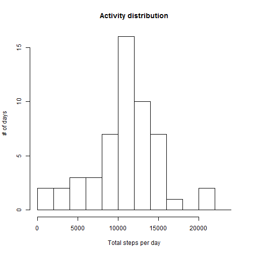
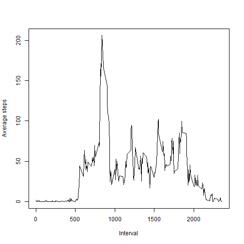
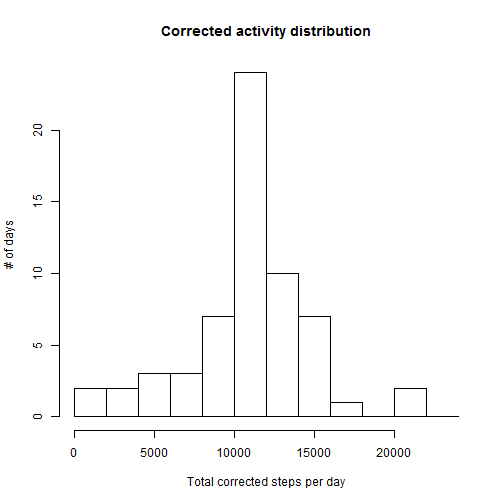
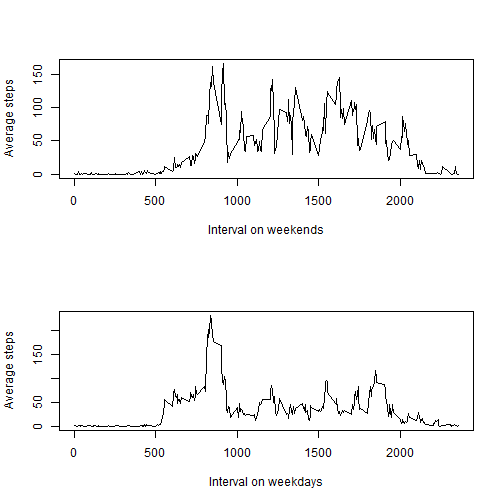

## Loading and preprocessing the data

```r
act <- read.csv(file = unz("activity.zip","activity.csv"), header = TRUE)
```

## What is mean total number of steps taken per day?
The distribution of total number of steps per day is centered around 10000:

```r
library(dplyr)
```

```r
act.byDay <- act %>% group_by(date) %>% summarize(stepsTotal=sum(steps))
hist(x = act.byDay$stepsTotal, main = "Activity distribution",xlab="Total steps per day",
     ylab="# of days", breaks=seq(0,24000,by=2000))                                                                                                                                         
```

 

The mean and median of this distribution are close to each other:

```r
summary(act.byDay$stepsTotal)[c("Mean","Median")]
```

```
##   Mean Median 
##  10770  10760
```

## What is the average daily activity pattern?
Average daily activity pattern (excluding missing values) is peaked around 9am:

```r
act.byInterval <- act %>% group_by(interval) %>% summarise(stepsAverage = mean(steps,na.rm = TRUE))
plot(act.byInterval, type = "l",xlab="Interval",ylab="Average steps")
```

 

The exact interval with maximum average activity is calculated as follows:

```r
filter(act.byInterval, stepsAverage == max(stepsAverage))$interval
```

```
## [1] 835
```

## Imputing missing values
There is a number of missing values of the variable steps in the dataset:

```r
sum(is.na(act$steps))
```

```
## [1] 2304
```
whereas the remaining variables (date & interval) are all valid:

```r
anyNA(act[c("date","interval")])
```

```
## [1] FALSE
```
meaning there are 2304 incomplete rows in the dataset, all of them due to the steps variable being NA.

As there are entire days without a single valid measurement of steps, take 10/1/2012 for instance:

```r
all(is.na(filter(act,date=="2012-10-01")$steps))
```

```
## [1] TRUE
```

but there are valid measurements for every interval:

```r
all( table(act$interval,is.na(act$steps))[,1] > 0)
```

```
## [1] TRUE
```

so that the missing values may be filled in using average over interval:

```r
act.corrected <- inner_join(act,act.byInterval,by="interval") %>% transmute(steps=ifelse(is.na(steps),round(stepsAverage),steps),date=date,interval=interval)
```

The corrected distribution of total number of steps per day is then:

```r
act.byDay.corrected <- act.corrected %>% group_by(date) %>% summarize(stepsTotal=sum(steps))
hist(x = act.byDay.corrected$stepsTotal, main = "Corrected activity distribution",xlab="Total corrected steps per day",
     ylab="# of days", breaks=seq(0,24000,by=2000))
```

 

with respective mean and median

```r
summary(act.byDay.corrected$stepsTotal)[c("Mean","Median")]
```

```
##   Mean Median 
##  10770  10760
```

It is noted that neither the mean nor the median are affected by the correction procedure but there are more entries in the corrected activity distribution due to days with missing data now being included in the histogram. Due to the adopted correction procedure and the structure of the missing values (entire days) all the new entries fall into the bin including the daily average value.

## Are there differences in activity patterns between weekdays and weekends?

Comparison of the average activity on weekends and weekdays:

```r
act.corrected$week <- factor(ifelse(format(as.Date(act.corrected$date),"%u")>"5","weekend","weekday"))
act.byWeekday <- act.corrected %>% group_by(week,interval) %>% summarize(stepsAverage=mean(steps))
op <- par(mfrow=c(2,1))
with(act.byWeekday[act.byWeekday$week=="weekend",],plot(interval,stepsAverage,type="l",ylab="Average steps",xlab="Interval on weekends"))
with(act.byWeekday[act.byWeekday$week=="weekday",],plot(interval,stepsAverage,type="l",ylab="Average steps",xlab="Interval on weekdays"))
```

 

```r
par(op)
```

Average activity per interval is a bit more flat during daytime on weekends than on weekdays.
